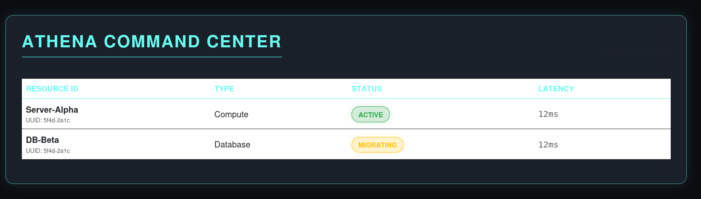

# Project Athena

A small resource-tracking dashboard: a Spring Boot REST API serving an in-memory list of resources, and an Angular SPA that displays them.



## What it actually does

- Backend exposes `GET /api/v1/resources` and `POST /api/v1/resources`, plus a `GET /api/status` health probe.
- Resources are held in an in-memory list owned by `ResourceService`. Restarting the server resets to two seed rows.
- Frontend fetches the list on load via `HttpClient` and renders it in a styled table.

This is a demo, not a production ERP. There is no database, no authentication, no multi-tenancy enforcement — `tenantId` is just a string field.

## Prerequisites

- JDK 21
- Node.js 18+ and npm

## Run it

**Backend** (port 9090):

```bash
cd backend
./mvnw spring-boot:run   # or: mvn spring-boot:run if you have Maven installed
```

**Frontend** (port 4200) — in a second terminal:

```bash
cd frontend
npm install
npm start
```

Open `http://localhost:4200`. The page will show "Unable to load resources" until the backend is up.

## Module layout

The backend follows one-idea-per-module:

```
backend/src/main/java/com/athena/
├── Application.java                  # bootstrap only
├── controller/
│   ├── HealthController.java         # /api/status
│   └── ResourceController.java       # HTTP layer for resources
├── model/
│   └── Resource.java                 # plain data class
└── service/
    └── ResourceService.java          # in-memory store
```

Frontend mirrors the same split:

```
frontend/src/app/
├── app.module.ts
├── app.component.ts
├── resource.model.ts                 # type
├── resource.service.ts               # HTTP client
└── resource-list/                    # presentation only
```

The controller does not own data, the service does not know about HTTP, the component does not know how the data is fetched. Each module has one reason to change.

## Tests

`backend/src/test/java/com/athena/ResourceControllerTest.java` covers the controller and service. Run with:

```bash
cd backend && mvn test
```

## CI

`azure-pipelines.yml` runs `mvn test` on push to `main`.

## License

MIT — see `LICENSE`.
